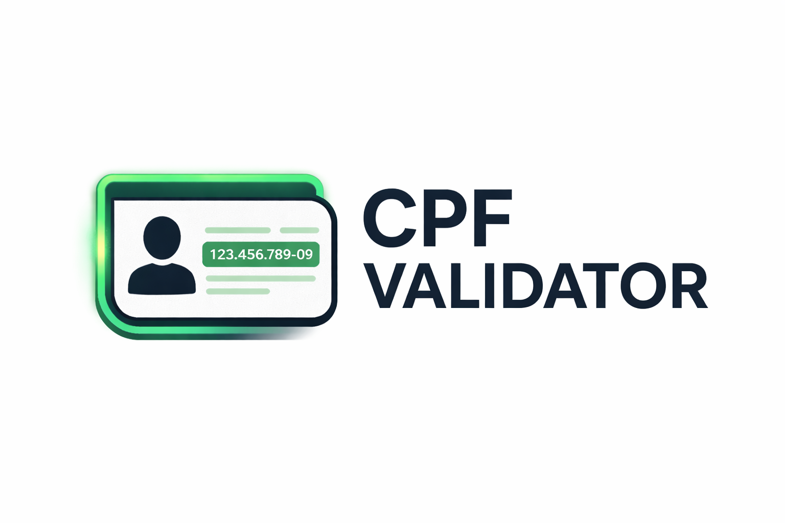

<p align="center">
  
</p>

<h1 align="center">CPF Validator</h1>

<p align="center">
  
</p>

<p align="center">
  <strong>Aplicação web para validação de CPF com API REST, testes automatizados e interface web.</strong>
</p>

<p align="center">
  
  
  
  
</p>

---

## CPF Validator API

Validador de CPF desenvolvido com Node.js, Express e arquitetura modular.
Este projeto foi construído em dupla:

  - Backend: **Matheus Pereira**
  - Frontend: **Phellipe Harry**

A aplicação oferece uma API REST para validação de CPF, incluindo testes automatizados, middleware de erros, arquitetura limpa e interface visual desenvolvida para validação instantânea no navegador.

---

## Sobre o Projeto

O **CPF Validator** é uma aplicação web completa para validação de CPF, composta por:

 - **API REST** desenvolvida em Node.js + Express
 - **Frontend web** em HTML e CSS
 - **Testes automatizados** (unitários e de integração)
 - **Arquitetura organizada** seguindo boas práticas de backend

---

## Funcionalidades

- Validação de CPF válido
- Identificação de CPF inválido
- Tratamento de CPF ausente
- Tratamento de CPF com caracteres inválidos
- Respostas padronizadas da API
- Testes unitários e de integração
- Interface web simples e intuitiva

---

## Arquitetura da API

A API segue separação clara de responsabilidades:

- **Routes** → definição das rotas HTTP
- **Controllers** → validações e controle de fluxo
- **Services** → lógica pura de validação de CPF
- **Middlewares** → tratamento global de erros
- **Tests** → testes unitários e de integração

---

## Screenshots

### Validação de CPF válido:
Exemplo de retorno visual quando o CPF informado é válido.

---

<p align="center">
  
</p>

---

### Validação de CPF inválido:
Exemplo de retorno visual quando o CPF informado é inválido.

---

<p align="center">
  
</p>

---

## Tecnologias Utilizadas

| Categoria              | Tecnologia                     |
|------------------------|--------------------------------|
| Linguagem              | JavaScript (Node.js)        |
| Framework Backend      | Express.js                     |
| Arquitetura            | Clean Architecture             |
| Testes de Integração   | Jest + Supertest               |
| Testes Unitários       | Jest                            |
| API                    | REST API                       |
| Frontend               | HTML5, CSS3                    |
| Gerenciador de Pacotes | npm                             |
| Controle de Versão     | Git & GitHub                   |
| Plataforma             | Web (Backend + Frontend)       |

---
## Como Executar o Projeto

### Clone o repositório:

```bash
git clone https://github.com/MatheusPereiira/cpf-validator-api
cd cpf-validator-api
```
## Instale as dependências:
```bash
npm install
```
## Executando o Servidor:
```bash
npm start
```
## Servidor disponível em:
```bash
http://localhost:3333
```
## Modo desenvolvimento com nodemon:
```bash
npm run dev
```
---

## Endpoints da API

#### Validar CPF:

---
```http
**GET** `/cpf/validate`
```

## Parâmetros de Query

| Parâmetro | Tipo   | Obrigatório | Descrição              |
|----------|--------|-------------|------------------------|
| CPF      | String | Sim         | CPF a ser validado     |

#### Exemplo de Requisição:
```http
GET /cpf/validate?cpf=123.456.789-09
```
---

#### Resposta de Sucesso:
```json
{
  "success": true,
  "data": {
    "cpf": "12345678909",
    "valid": true
  }
```

---

## Respostas de Erro


#### Códigos de Erro:

| Código HTTP | Código Interno           | Descrição                              |
|------------|--------------------------|----------------------------------------|
| 400        | CPF_REQUIRED             | CPF não informado                      |
| 400        | CPF_FORMAT_INVALID       | CPF contém caracteres inválidos        |
| 422        | CPF_INVALID              | CPF informado é inválido               |
| 500        | INTERNAL_SERVER_ERROR    | Erro interno do servidor               |

---

#### Exemplo de Erro:

```json
{
  "success": false,
  "error": {
    "code": "CPF_INVALID",
    "message": "CPF informado é inválido"
  }
}
```

---

## Testes Automatizados

 - O projeto possui dois níveis de testes.

---

#### Testes de Integração:
```json
tests/cpf.test.js
```

 - Testa a API completa, incluindo rotas, middlewares e respostas HTTP.

--- 

#### Testes Unitários:

```json
tests/cpfService.test.js
```

 - Testa exclusivamente a lógica pura de validação do CPF, sem dependência do Express.

--- 

## Executar Testes

```json
npm test
```

#### Resultado esperado:

```bash
Test Suites: 2 passed
Tests:       8 passed
```

---

## Arquitetura do Projeto

```text
CPF-VALIDATOR-API/
├── assets/
│   ├── banner.jpg
│   ├── logo.png
│   ├── cpf_valido.png
│   └── cpf_invalido.png
│
├── src/
│   ├── controllers/
│   │   └── cpfController.js
│   │
│   ├── middlewares/
│   │   └── errorHandler.js
│   │
│   ├── public/
│   │   ├── index.html
│   │   └── style.css
│   │
│   ├── routes/
│   │   └── cpfRoutes.js
│   │
│   ├── services/
│   │   └── cpfService.js
│   │
│   ├── utils/
│   │   └── AppError.js
│   │
│   ├── app.js
│   └── server.js
│
├── tests/
│   ├── cpf.test.js
│   └── cpfService.test.js
│
├── .gitignore
├── .gitattributes
├── package.json
├── package-lock.json
└── README.md
```

---

## Licença
 - Este projeto está sob a **MIT License**, permitindo uso livre para estudo, modificação e distribuição.

 ---

## Autores

**Matheus Pereira**<br> 
Desenvolvedor Backend: https://github.com/MatheusPereiira <br> 
Responsável pela API, arquitetura, testes automatizados, documentação e integração.

**Phellipe Harry**<br> 
Desenvolvedor Frontend: https://github.com/phellipeharry <br> 
Responsável pela interface visual em HTML e CSS e identidade visual do projeto.

---